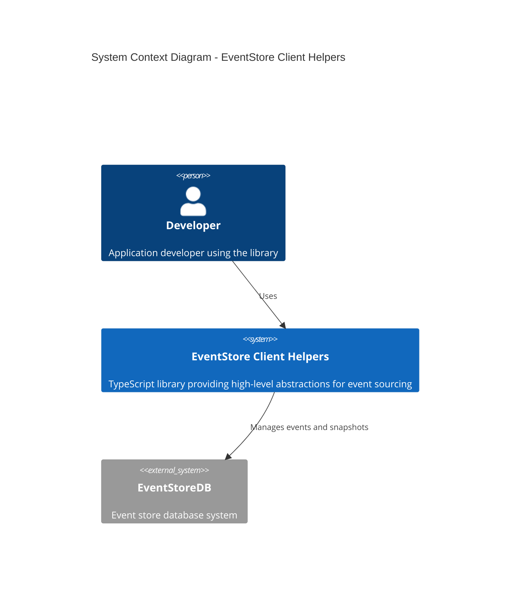
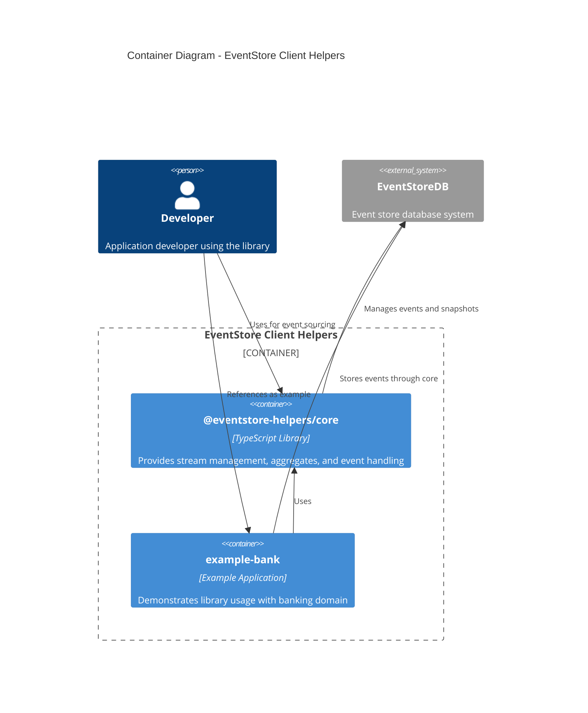

# EventStore Client Helpers

[](https://www.typescriptlang.org/)
[](https://www.eventstore.com/)
[](https://opensource.org/licenses/MIT)

A collection of tools and examples for working with [EventStoreDB](https://www.eventstore.com/) in TypeScript.

## Architecture

### System Context Diagram



### Container Diagram



## Projects

This monorepo contains the following projects:

### [`@eventstore-helpers/core`](./projects/eventstore-helpers/README.md)

A TypeScript library that simplifies working with EventStoreDB by providing high-level abstractions for common event sourcing patterns. Features include:
- Stream management
- Automatic snapshotting
- Event versioning and migrations
- Type-safe event handling

### [`example-bank`](./projects/example-bank/README.md)

A complete example application demonstrating how to build an event-sourced banking system using `@eventstore-helpers/core`. Features include:
- Account creation and management
- Deposits and withdrawals
- Event versioning
- Automatic snapshots

## Getting Started

1. Clone the repository:
   ```bash
   git clone https://github.com/yourusername/EventStore-Client-Helpers.git
   cd EventStore-Client-Helpers
   ```

2. Install dependencies:
   ```bash
   npm install
   ```

3. See the individual project READMEs for specific setup instructions:
   - [EventStore Helpers Core Documentation](./projects/eventstore-helpers/README.md)
   - [Example Bank Application Documentation](./projects/example-bank/README.md)

## Building Event-Sourced Aggregates

The EventStore Client Helpers make it easy to implement event-sourced aggregates in TypeScript. Here's a quick example:

```typescript
import { StreamHelper, BaseEvent } from '@eventstore-helpers/core';

// 1. Define your events
interface AccountCreated extends BaseEvent<'AccountCreated'> {
  data: {
    owner: string;
    initialBalance: number;
    accountType: 'savings' | 'checking';
  };
}

interface MoneyDeposited extends BaseEvent<'MoneyDeposited'> {
  data: {
    amount: number;
    description?: string;
  };
}

type AccountEvent = AccountCreated | MoneyDeposited;

// 2. Define your aggregate state
interface AccountState {
  owner: string;
  balance: number;
  accountType: 'savings' | 'checking';
  version: number;
}

// 3. Create your aggregate class
class BankAccount {
  private streamHelper: StreamHelper<AccountEvent, AccountState>;
  
  constructor(client: EventStoreDBClient) {
    this.streamHelper = new StreamHelper(client, {
      snapshotFrequency: 5,
      currentEventVersion: 1
    });
  }

  // 4. Implement state rebuilding
  private applyEvent(state: AccountState | null, event: AccountEvent): AccountState {
    if (event.type === 'AccountCreated') {
      return {
        owner: event.data.owner,
        balance: event.data.initialBalance,
        accountType: event.data.accountType,
        version: 1
      };
    }
    
    if (!state) throw new Error('Account not found');
    
    if (event.type === 'MoneyDeposited') {
      return {
        ...state,
        balance: state.balance + event.data.amount,
        version: state.version + 1
      };
    }
    
    return state;
  }

  // 5. Implement business methods
  async createAccount(
    accountId: string,
    owner: string,
    initialBalance: number,
    accountType: 'savings' | 'checking' = 'checking'
  ): Promise<void> {
    await this.streamHelper.appendEvent(accountId, {
      type: 'AccountCreated',
      data: { owner, initialBalance, accountType }
    });
  }

  async deposit(accountId: string, amount: number, description?: string): Promise<void> {
    // First get current state
    const { state } = await this.streamHelper.getCurrentState(
      accountId,
      this.applyEvent
    );
    
    if (!state) throw new Error('Account not found');
    
    // Then append new event
    await this.streamHelper.appendEvent(accountId, {
      type: 'MoneyDeposited',
      data: { amount, description }
    });
  }

  async getBalance(accountId: string): Promise<number> {
    const { state } = await this.streamHelper.getCurrentState(
      accountId,
      this.applyEvent
    );
    return state?.balance ?? 0;
  }
}
```

This example demonstrates key features of the library:

1. **Type-Safe Events**: Events are defined as TypeScript interfaces extending `BaseEvent`
2. **Automatic Snapshots**: Configure `snapshotFrequency` for automatic state snapshots
3. **State Management**: Use `getCurrentState` to rebuild aggregate state from events
4. **Event Appending**: Simple event appending with `appendEvent`
5. **Business Logic**: Implement domain logic in your aggregate methods

For a complete example including event versioning, migrations, and more complex business rules, see the [example-bank](./projects/example-bank/README.md) project.

## Contributing

Contributions are welcome! Please feel free to submit a Pull Request.

## License

This project is licensed under the MIT License - see the [LICENSE](./LICENSE) file for details.
