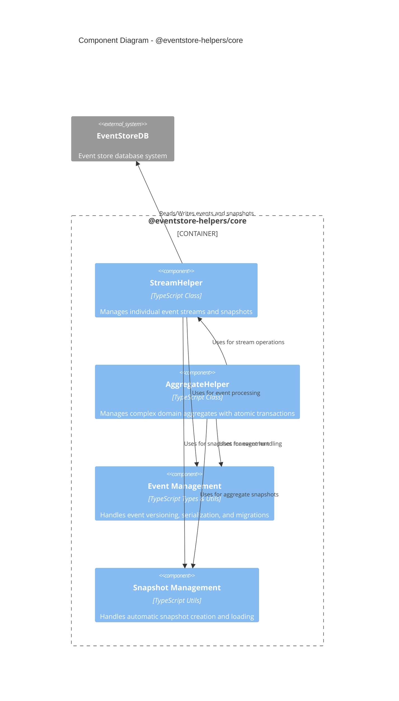

# EventStore Client Helpers

A TypeScript library that simplifies working with EventStoreDB by providing high-level abstractions for common event sourcing patterns.

Part of the [EventStore Client Helpers](../../README.md) project.

## Features

- **Stream Management**: Easy-to-use `StreamHelper` class for managing event streams
- **Aggregate Root Support**: `AggregateHelper` class for managing complex domain aggregates with atomic transactions
- **Automatic Snapshotting**: Configurable automatic snapshot creation for performance optimization
- **Event Versioning**: Built-in support for event versioning and migrations
- **Type Safety**: Full TypeScript support with generics for type-safe event handling
- **JSON Compatibility**: Automatic handling of JSON serialization/deserialization
- **State Rebuilding**: Efficient state rebuilding from events and snapshots
- **Multi-Stream Transactions**: Support for atomic operations across multiple streams

## Architecture

### Component Diagram



## Installation

```bash
npm install @eventstore-helpers/core
```

## Quick Start

### Basic Stream Management

```typescript
import { EventStoreDBClient } from '@eventstore/db-client';
import { StreamHelper, BaseEvent, StreamConfig } from '@eventstore-helpers/core';

// Define your events
interface AccountCreated extends BaseEvent<'AccountCreated'> {
  data: {
    owner: string;
    initialBalance: number;
  };
}

// Create EventStoreDB client
const client = EventStoreDBClient.connectionString('esdb://localhost:2113?tls=false');

// Configure stream helper
const config: StreamConfig = {
  snapshotFrequency: 5,
  snapshotPrefix: '-snapshot',
  currentEventVersion: 1
};

// Create stream helper instance
const streamHelper = new StreamHelper(client, config);

// Append events
await streamHelper.appendEvent('account-123', {
  type: 'AccountCreated',
  data: {
    owner: 'John Doe',
    initialBalance: 1000
  }
});
```

### Aggregate Root Management

```typescript
import { AggregateHelper, BaseEvent } from '@eventstore-helpers/core';

// Define your aggregate events
interface AccountEvent extends BaseEvent {
  affectedEntities?: Array<{
    id: string;
    type: string;
    version: number;
  }>;
}

// Configure aggregate helper
const config = {
  snapshotFrequency: 5,
  currentEventVersion: 1,
  aggregatePrefix: 'account-',
  entityPrefixes: {
    transaction: 'transaction-'
  }
};

// Create aggregate helper instance
const aggregateHelper = new AggregateHelper(client, config);

// Start a transaction
await aggregateHelper.beginTransaction('123');

try {
  // Add events with affected entities
  await aggregateHelper.addEvent('123', {
    type: 'MoneyDeposited',
    data: { amount: 1000 }
  }, [
    { id: 'tx-1', type: 'transaction', version: 1 }
  ]);

  // Commit all changes atomically
  await aggregateHelper.commitTransaction('123');
} catch (error) {
  // Rollback on error
  await aggregateHelper.rollbackTransaction('123');
  throw error;
}
```

## Key Concepts

### Stream Helper

The `StreamHelper` class provides methods for:
- Appending events to streams
- Reading events from streams
- Managing snapshots
- Rebuilding aggregate state
- Handling event migrations

### Aggregate Helper

The `AggregateHelper` class extends `StreamHelper` to provide advanced aggregate root management:
- Atomic transactions across multiple streams
- Entity reference tracking
- Transaction lifecycle management (begin/commit/rollback)
- Automatic versioning of related entities

### Event Versioning

Support for event versioning with automatic migrations:

```typescript
const config: StreamConfig = {
  currentEventVersion: 2,
  eventMigrations: [{
    fromVersion: 1,
    toVersion: 2,
    eventType: 'AccountCreated',
    migrate: (event) => ({
      ...event,
      data: {
        ...event.data,
        accountType: 'checking'  // Add new field
      }
    })
  }]
};
```

### Snapshotting

Automatic snapshot creation after configured number of events:

```typescript
const config: StreamConfig = {
  snapshotFrequency: 5,  // Create snapshot every 5 events
  snapshotPrefix: '-snapshot'
};
```

## Example Application

See the [example-bank](../example-bank) project for a complete example of building an event-sourced banking application using this library.

## API Reference

### StreamHelper

#### Constructor
```typescript
constructor(client: EventStoreDBClient, config: StreamConfig)
```

#### Methods
- `appendEvent(streamId: string, event: E, expectedRevision?: bigint): Promise<void>`
- `getCurrentState(streamId: string, applyEvent: (state: S | null, event: E) => S): Promise<{ state: S | null; version: number }>`
- `getLatestSnapshot(streamId: string): Promise<Snapshot<S> | null>`
- `createSnapshot(streamId: string, state: S | null, version: number): Promise<void>`

### AggregateHelper

#### Constructor
```typescript
constructor(client: EventStoreDBClient, config: AggregateConfig)
```

#### Methods
- `beginTransaction(aggregateId: string): Promise<void>`
- `addEvent(aggregateId: string, event: E, affectedEntities?: Array<{ id: string; type: string; version: number }>): Promise<void>`
- `commitTransaction(aggregateId: string): Promise<void>`
- `rollbackTransaction(aggregateId: string): Promise<void>`

### Types

- `BaseEvent<T, D>`: Base type for all events
- `StreamConfig`: Configuration options for StreamHelper
- `AggregateConfig`: Configuration options for AggregateHelper
- `EventMigration`: Event migration definition
- `Snapshot`: Snapshot data structure
- `JSONType`: Type for JSON-compatible objects

## License

MIT
