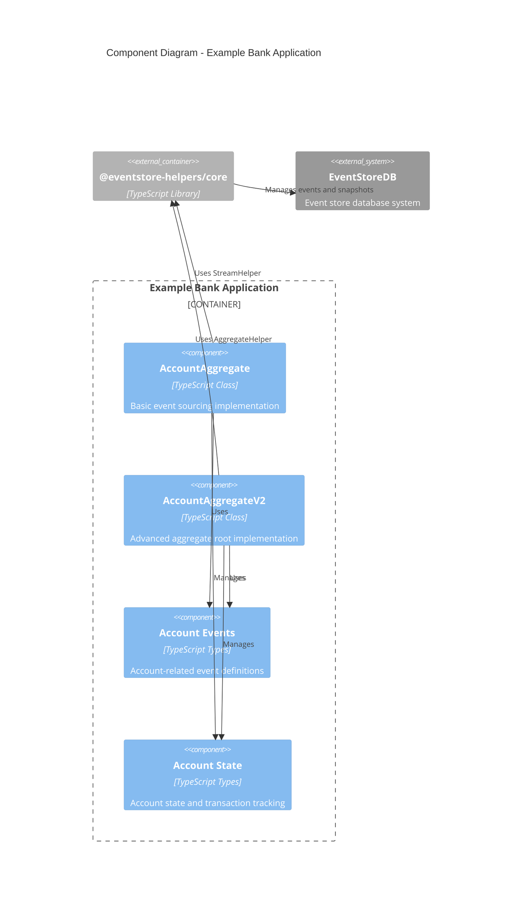
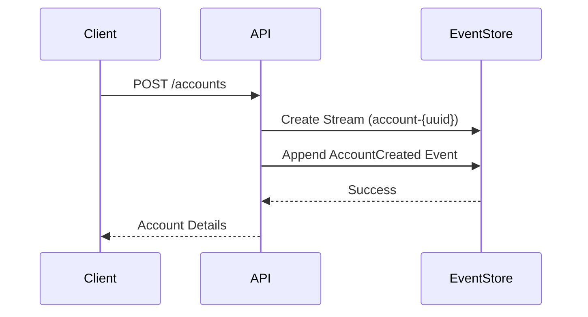
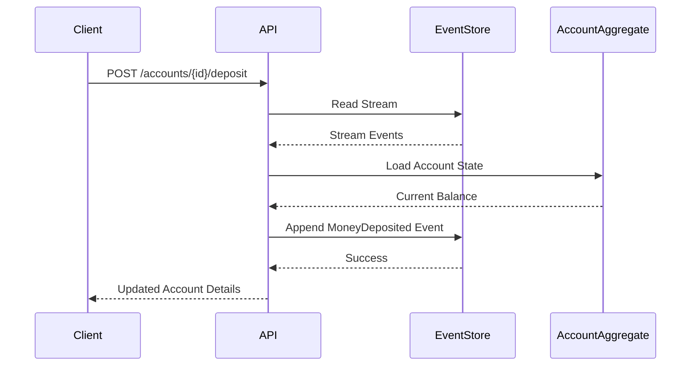
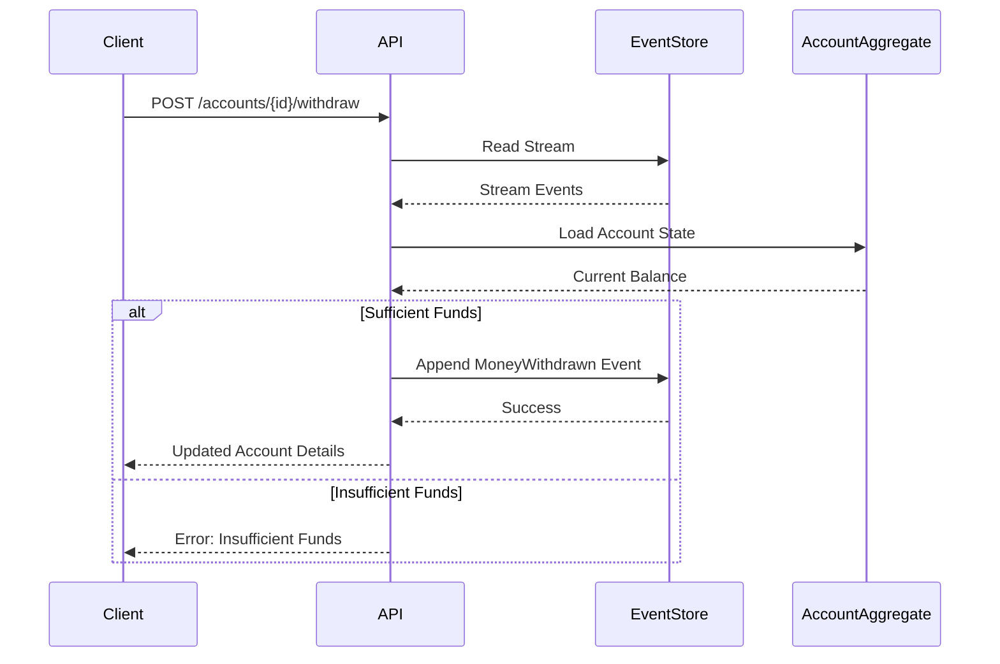
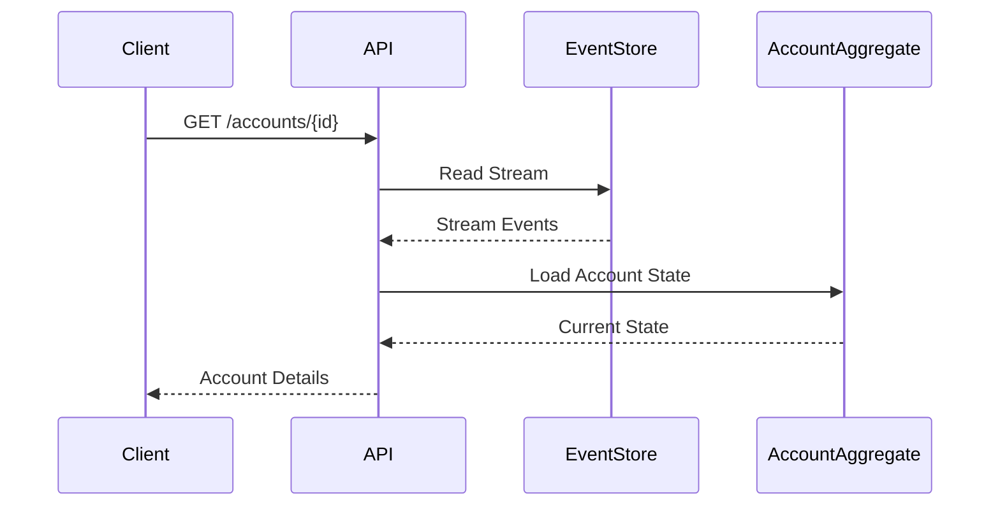

# Example Bank Application

This is an example application demonstrating the usage of [`@eventstore-helpers/core`](../eventstore-helpers/README.md) package for building an event-sourced banking system.

Part of the [EventStore Client Helpers](../../README.md) project.

## Features

- Create bank accounts (savings or checking)
- Deposit money with optional description
- Withdraw money with optional description
- View account details
- Automatic snapshots every 5 events
- Event versioning and migration support
- Atomic transactions with aggregate root support (V2)
- Transaction tracking across multiple streams (V2)

## Architecture

### Component Diagram



## Implementation Versions

### V1 (Basic Event Sourcing)
The basic implementation (`AccountAggregate`) demonstrates simple event sourcing patterns:
- Single stream per account
- Basic event handling
- Snapshot support
- Event versioning

### V2 (Aggregate Root)
The advanced implementation (`AccountAggregateV2`) showcases complex domain modeling using the Aggregate Root pattern from Domain-Driven Design:

#### Aggregate Root Pattern Implementation
The `AccountAggregateV2` class demonstrates how to implement an aggregate root that manages the consistency of multiple related entities:

1. **Consistency Boundary**
   - The account aggregate manages both the account state and its transactions
   - All modifications must go through the aggregate root
   - Ensures business rules and invariants are maintained across entities

2. **Transaction Management**
   ```typescript
   interface TransactionEntity {
     id: string;
     type: 'transaction';
     version: number;
   }
   ```
   - Each operation creates and manages transaction entities
   - Transactions are atomic and consistent with account state changes
   - Automatic rollback ensures data consistency on failures

3. **Entity Relationships**
   ```typescript
   entityPrefixes: {
     transaction: 'transaction'
   }
   ```
   - Manages relationships between account and transactions
   - Maintains referential integrity within the aggregate boundary
   - Provides clear entity type identification

4. **Invariant Protection**
   - Enforces business rules across multiple entities:
     - Account must exist before transactions
     - Sufficient funds for withdrawals
     - Balance consistency across all transactions
   - Validates state changes before committing

5. **Atomic Operations**
   ```typescript
   await aggregateHelper.beginTransaction(accountId);
   try {
     await aggregateHelper.addEvent(accountId, event, [transactionEntity]);
     await aggregateHelper.commitTransaction(accountId);
   } catch (error) {
     await aggregateHelper.rollbackTransaction(accountId);
   }
   ```
   - All changes are atomic
   - Maintains consistency across multiple entities
   - Automatic rollback on failures

This implementation follows DDD best practices by:
- Encapsulating business logic within the aggregate
- Protecting invariants across multiple entities
- Ensuring atomic operations
- Managing entity lifecycles
- Maintaining clear consistency boundaries

### Advanced Usage (V2)
```typescript
import { AccountAggregateV2 } from './accountAggregateV2';

const account = new AccountAggregateV2(client);

// Create account with transaction tracking
const accountId = await account.createAccount('John Doe', 1000, 'savings');

// Atomic deposit operation
await account.deposit(accountId, 500, 'Salary', {
  userId: 'user123',
  source: 'web',
  transactionId: 'tx123'
});

// Atomic withdrawal with transaction tracking
await account.withdraw(accountId, 200, 'ATM Withdrawal', {
  userId: 'user123',
  source: 'atm',
  transactionId: 'tx124'
});

// Get current account state
const accountState = await account.getAccount(accountId);
```

## Getting Started

1. Make sure you have EventStoreDB running locally:
```bash
docker run --name esdb-node -d -p 2113:2113 -p 1113:1113 eventstore/eventstore:latest --insecure --run-projections=All
```

2. Install dependencies:
```bash
npm install
```

3. Start the application:
```bash
npm run dev
```

## Usage Examples

### Basic Usage (V1)
```typescript
import { AccountAggregate } from './account';

const account = new AccountAggregate(client);
const accountId = await account.createAccount('John Doe', 1000, 'savings');
await account.deposit(accountId, 500, 'Salary');
await account.withdraw(accountId, 200, 'ATM Withdrawal');
```

## API Endpoints

### Create Account
```bash
curl -X POST http://localhost:3000/accounts \
  -H "Content-Type: application/json" \
  -d '{
    "owner": "John Doe",
    "initialBalance": 1000,
    "accountType": "savings"  // Optional, defaults to "checking"
  }'
```

### Get Account Details
```bash
curl http://localhost:3000/accounts/{accountId}
```

### Deposit Money
```bash
curl -X POST http://localhost:3000/accounts/{accountId}/deposit \
  -H "Content-Type: application/json" \
  -d '{
    "amount": 500,
    "userId": "user123",
    "description": "Birthday gift"  // Optional
  }'
```

### Withdraw Money
```bash
curl -X POST http://localhost:3000/accounts/{accountId}/withdraw \
  -H "Content-Type: application/json" \
  -d '{
    "amount": 200,
    "userId": "user123",
    "description": "ATM withdrawal"  // Optional
  }'
```

## System Architecture

### Account Creation Flow


### Deposit Flow


### Withdrawal Flow


### Query Account Flow


## Implementation Details

This example demonstrates:
1. Event sourcing patterns using EventStoreDB
2. Aggregate pattern for maintaining consistency
3. Automatic snapshotting for performance optimization
4. RESTful API design
5. Error handling and validation
6. Event versioning and migration support

The application uses the `StreamHelper` class from `@eventstore-helpers/core` to:
- Manage event streams for each bank account
- Handle snapshots automatically
- Rebuild account state from events and snapshots
- Migrate events between versions

### Event Versioning

The application supports versioned events with automatic migration capabilities:

- **Version 1**: Basic events with core fields
  - AccountCreated: owner, initialBalance
  - MoneyDeposited: amount
  - MoneyWithdrawn: amount

- **Version 2**: Enhanced events with additional fields
  - AccountCreated: added accountType (savings/checking)
  - MoneyDeposited: added optional description
  - MoneyWithdrawn: added optional description

Events are automatically migrated to the latest version when retrieved from the event store. The migration system is extensible, allowing for future versions to be added with custom migration logic.
