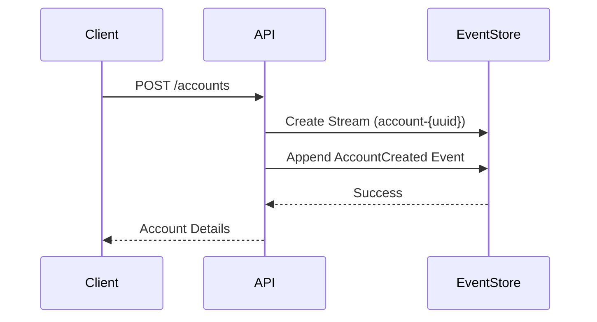
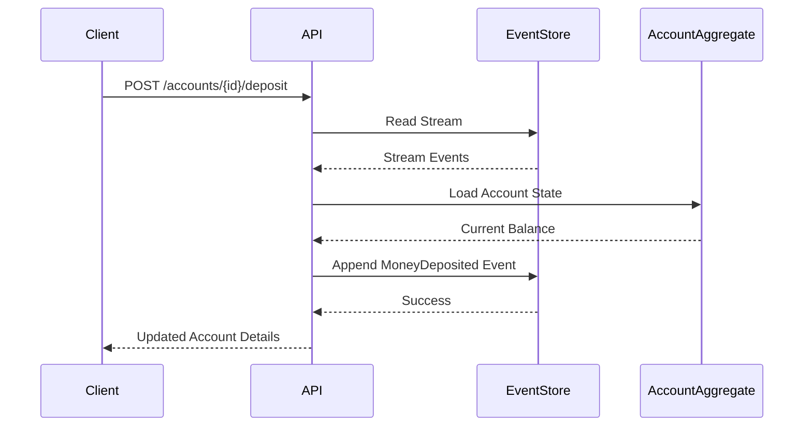
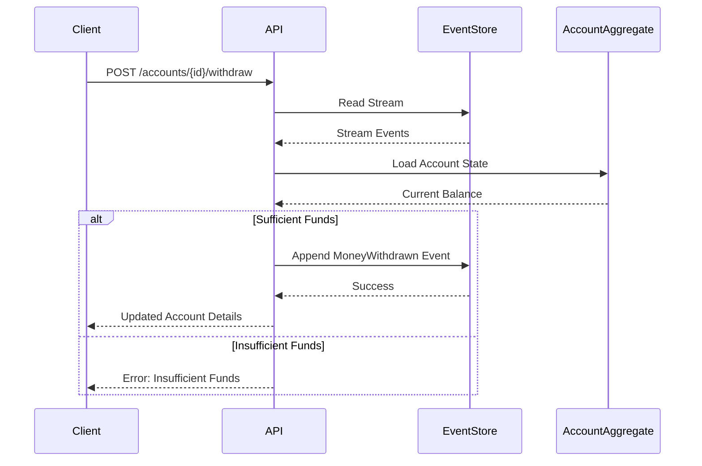
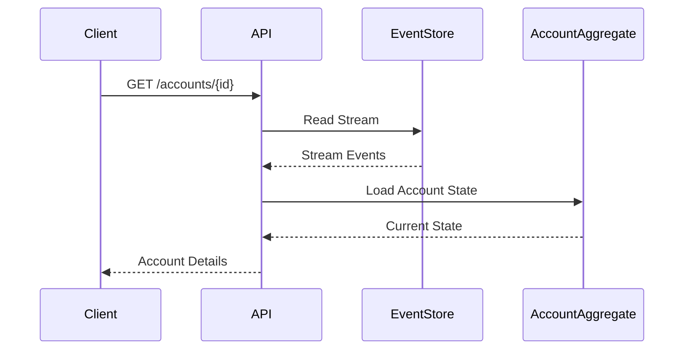

# Example Bank Application

This is an example application demonstrating the usage of [`@eventstore-helpers/core`](../eventstore-helpers/README.md) package for building an event-sourced banking system.

Part of the [EventStore Client Helpers](../../README.md) project.

## Features

- Create bank accounts (savings or checking)
- Deposit money with optional description
- Withdraw money with optional description
- View account details
- Automatic snapshots every 5 events
- Event versioning and migration support

## Getting Started

1. Make sure you have EventStoreDB running locally:
```bash
docker run --name esdb-node -d -p 2113:2113 -p 1113:1113 eventstore/eventstore:latest --insecure --run-projections=All
```

2. Install dependencies:
```bash
npm install
```

3. Start the application:
```bash
npm run dev
```

## API Endpoints

### Create Account
```bash
curl -X POST http://localhost:3000/accounts \
  -H "Content-Type: application/json" \
  -d '{
    "owner": "John Doe",
    "initialBalance": 1000,
    "accountType": "savings"  // Optional, defaults to "checking"
  }'
```

### Get Account Details
```bash
curl http://localhost:3000/accounts/{accountId}
```

### Deposit Money
```bash
curl -X POST http://localhost:3000/accounts/{accountId}/deposit \
  -H "Content-Type: application/json" \
  -d '{
    "amount": 500,
    "userId": "user123",
    "description": "Birthday gift"  // Optional
  }'
```

### Withdraw Money
```bash
curl -X POST http://localhost:3000/accounts/{accountId}/withdraw \
  -H "Content-Type: application/json" \
  -d '{
    "amount": 200,
    "userId": "user123",
    "description": "ATM withdrawal"  // Optional
  }'
```

## System Architecture

### Account Creation Flow


### Deposit Flow


### Withdrawal Flow


### Query Account Flow


## Implementation Details

This example demonstrates:
1. Event sourcing patterns using EventStoreDB
2. Aggregate pattern for maintaining consistency
3. Automatic snapshotting for performance optimization
4. RESTful API design
5. Error handling and validation
6. Event versioning and migration support

The application uses the `StreamHelper` class from `@eventstore-helpers/core` to:
- Manage event streams for each bank account
- Handle snapshots automatically
- Rebuild account state from events and snapshots
- Migrate events between versions

### Event Versioning

The application supports versioned events with automatic migration capabilities:

- **Version 1**: Basic events with core fields
  - AccountCreated: owner, initialBalance
  - MoneyDeposited: amount
  - MoneyWithdrawn: amount

- **Version 2**: Enhanced events with additional fields
  - AccountCreated: added accountType (savings/checking)
  - MoneyDeposited: added optional description
  - MoneyWithdrawn: added optional description

Events are automatically migrated to the latest version when retrieved from the event store. The migration system is extensible, allowing for future versions to be added with custom migration logic.
